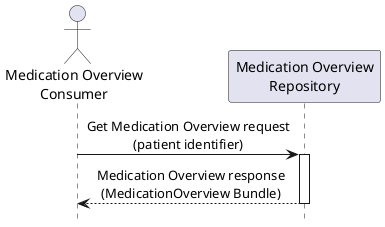

This section corresponds to transaction [PHARM-x] of the IHE Pharmacy Technical Framework. Transaction [PHARM-x] is used by the Medication Overview Consumer and Medication Overview Repository actors.

### 1:33.x.1 Scope

The Get Medication Overview transaction is used by a Medication Overview Consumer to query a Medication Overview Repository and retrieve an existing Medication Overview for a patient. It is a pull (query/response) interaction over already-recorded medication information; it does not create or modify any data.

### 1:33.x.2 Actor Roles

<table border="1" borderspacing="0" style='border: 1px solid black; border-collapse: collapse'>
<thead>
<tr class="odd" style='background: gray;'>
<th>Actor</th>
<th>Role</th>
</tr>
</thead>
<tbody>
<tr class="even">
<td><a href="actors-transactions.html#133111-medication-overview-consumer">Medication Overview Consumer</a></td>
<td>Requests the Medication Overview for a patient from the Medication Overview Repository.</td>
</tr>
<tr class="odd">
<td><a href="actors-transactions.html#133112-medication-overview-repository">Medication Overview Repository</a></td>
<td>Receives the request and returns the Medication Overview held for the patient.</td>
</tr>
</tbody>
</table>

### 1:33.x.3 Referenced Standards

**FHIR R4** &mdash; <a href="http://hl7.org/fhir/R4/">HL7 FHIR Release 4.0.1</a>

### 1:33.x.4 Interaction Diagram

#### 1:33.x.4.1 Get Medication Overview Request

The Medication Overview Consumer sends a request to the Medication Overview Repository identifying the patient whose Medication Overview is sought. The request is a FHIR RESTful query.

#### 1:33.x.4.2 Get Medication Overview Response

The Medication Overview Repository returns the Medication Overview for the identified patient as a [Medication Overview Bundle](StructureDefinition-MedicationOverview.html) document, containing the Composition and the referenced medication treatment lines.

If no Medication Overview is available for the patient, the Repository returns an empty result.

### 1:33.x.5 Expected Actions

The Medication Overview Repository shall return the current Medication Overview held for the identified patient. The Medication Overview Consumer presents or further processes the retrieved information.
