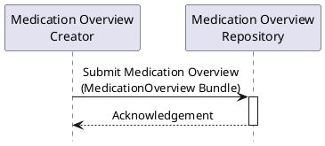

This section corresponds to transaction [PHARM-y] of the IHE Pharmacy Technical Framework. Transaction [PHARM-y] is used by the Medication Overview Creator and Medication Overview Repository actors.

### 1:33.y.1 Scope

The Submit Medication Overview transaction is used by a Medication Overview Creator to submit a Medication Overview - the set of medication treatment lines summarizing the patient's medication - to a Medication Overview Repository. It is a push interaction: the Creator provides the medication information to be stored and made available for later retrieval.

### 1:33.y.2 Actor Roles

<table border="1" borderspacing="0" style='border: 1px solid black; border-collapse: collapse'>
<thead>
<tr class="odd" style='background: gray;'>
<th>Actor</th>
<th>Role</th>
</tr>
</thead>
<tbody>
<tr class="even">
<td><a href="actors-transactions.html#133113-medication-overview-creator">Medication Overview Creator</a></td>
<td>Assembles the Medication Overview and submits it to the Medication Overview Repository.</td>
</tr>
<tr class="odd">
<td><a href="actors-transactions.html#133112-medication-overview-repository">Medication Overview Repository</a></td>
<td>Receives, validates and stores the submitted Medication Overview.</td>
</tr>
</tbody>
</table>

### 1:33.y.3 Referenced Standards

**FHIR R4** &mdash; <a href="http://hl7.org/fhir/R4/">HL7 FHIR Release 4.0.1</a>

### 1:33.y.4 Interaction Diagram

#### 1:33.y.4.1 Submit Medication Overview Message

The Medication Overview Creator sends a [Medication Overview Bundle](StructureDefinition-MedicationOverview.html) document to the Medication Overview Repository. The Bundle contains the Composition and the medication treatment lines for a single patient.

#### 1:33.y.4.2 Acknowledgement

The Medication Overview Repository returns an acknowledgement indicating whether the submission was accepted.

### 1:33.y.5 Expected Actions

The Medication Overview Repository shall store the submitted Medication Overview so that it can subsequently be retrieved through the [Get Medication Overview [PHARM-x]](PHARM-x.html) transaction.

### 1:33.y.6 Workflow Examples

The following scenarios illustrate how medication treatment lines are produced before being summarized into a Medication Overview.

**Begin treatment with line**

This is a normal case, where the medication line is the trigger for prescriptions.

1. Psychiatrist decides that patient should initiate treatment for depression, indicating bupropion. They create a treatment line for that patient. No prescription is necessarily authorized yet.
   * At this moment, querying a patient's current medications should return this line, with status "????"
2. After checking contraindications, psychiatrist decides to treat the patient with fluoxetine instead. The prescription is finally issued for 1 box of 30 tablets.
   * At this moment, querying a patient's current medications should return this line, with status "????"
3. When medication is dispensed, the medication line is not updated but the medication may be added to the link.

**Treatments from prescriptions**

This is the other normal case, where the medication line is derived from existing prescriptions.

1. Patient visits the GP who issues a prescription.
2. From the prescription, a medication line is created (or updated if one already exists).

